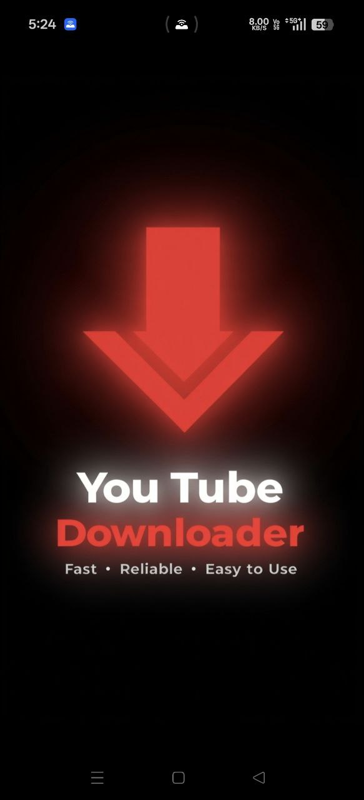
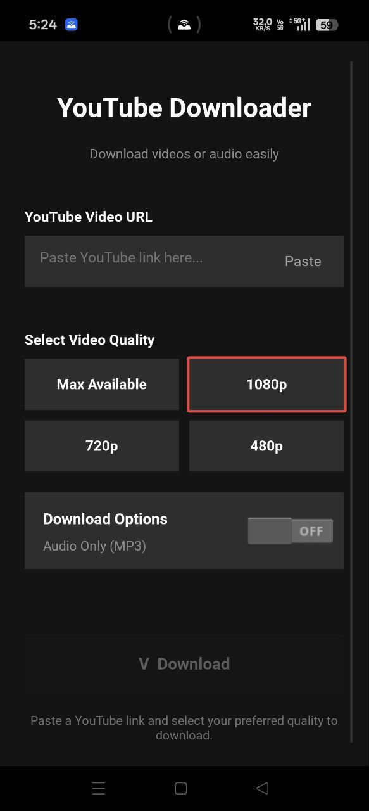
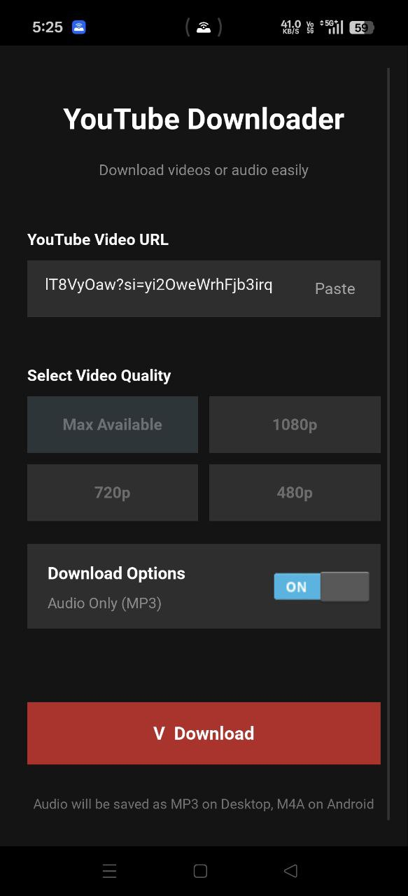
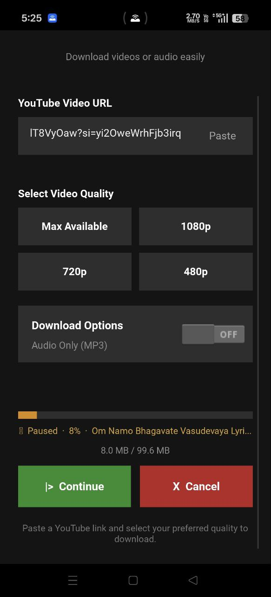
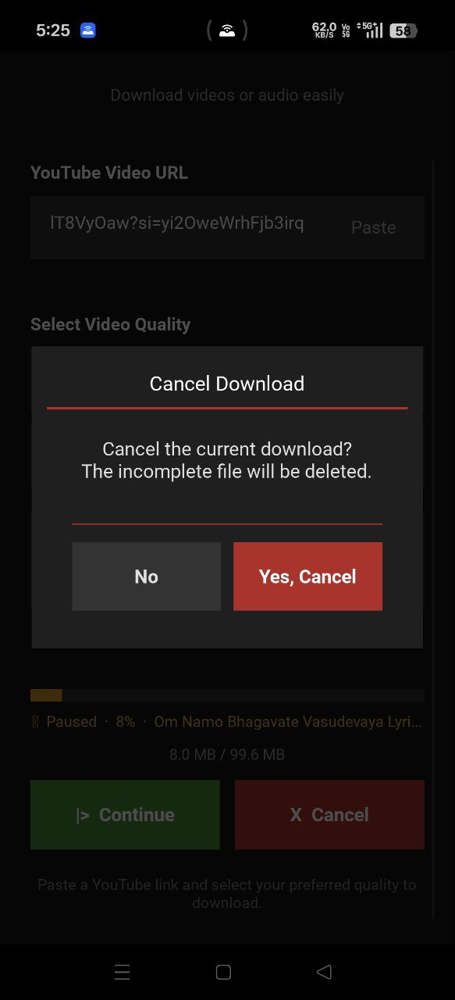

<div align="center">

<svg width="120" height="120" viewBox="0 0 120 120" xmlns="http://www.w3.org/2000/svg">
  <defs>
    <clipPath id="circle">
      <circle cx="60" cy="60" r="60"/>
    </clipPath>
  </defs>
  <image href="icon.png" width="120" height="120" clip-path="url(#circle)"/>
</svg>

# YouTube Downloader

**A powerful, open-source YouTube downloader built with Kivy and yt-dlp**  
Download videos and audio directly to your Android device — even in the background.

[](https://www.android.com)
[](https://python.org)
[](https://kivy.org)
[](https://github.com/yt-dlp/yt-dlp)
[](LICENSE)

</div>

---

## Table of Contents

- [Screenshots](#screenshots)
- [Features](#features)
- [Installation](#installation)
- [Building from Source](#building-from-source)
- [Usage](#usage)
- [Project Structure](#project-structure)
- [Technical Details](#technical-details)
- [Permissions](#permissions)
- [Troubleshooting](#troubleshooting)

---

## Screenshots

<div align="center">

|Splash Screen| Home Screen | Audio Mode |
|:-----------:|:-----------:|:----------:|
| |  |  |
|Welcom Page| Paste a YouTube link and choose quality | Toggle Audio Only for MP3/M4A downloads |

| Downloading (Paused) | Cancel Confirmation |
|:--------------------:|:-------------------:|
|  |  |
| Pause mid-download and resume anytime | Confirm before cancelling — incomplete files are auto-deleted |

</div>

---

## Features

### Core Download Features
- **Video download** — up to Max / 1080p / 720p / 480p quality
- **Audio download** — M4A (Android native) or MP3 (Desktop via ffmpeg)
- **Playlist support** — automatically detects and downloads all videos in a playlist
- **Resume interrupted downloads** — picks up where it left off if cut short
- **Smart format selection** — picks the best available format for your chosen quality

### Download Controls
- **Pause / Continue** — freeze a download mid-way and resume from exactly where it stopped
- **Cancel with confirmation** — prompts before cancelling; automatically deletes leftover `.part` files so no storage is wasted
- **Live progress display** — shows percentage, downloaded size vs total size, filename
- **Speed & ETA** — real-time download speed (MB/s) and estimated time remaining (Android)

### Background Download (Android)
- **Runs as a Foreground Service** — download continues even when you switch apps or lock your screen
- **Live notification bar** — shows progress percentage, file size, and speed in the Android notification shade
- **Tap notification to return** — brings the app back to foreground
- **Sticky notification** — cannot be accidentally dismissed while a download is active

### Storage
- **Saves to system Downloads folder** — files visible in any file manager app
- **Organised subfolders** — `Downloads/YouTubeDownloader/Video/` and `.../Audio/`
- **Files survive app uninstall** — stored in public Downloads, not app-private storage


### Platform Support
| Feature | Android | Desktop / WSL |
|---------|:-------:|:-------------:|
| Video download | ✅ | ✅ |
| Audio download (M4A) | ✅ | — |
| Audio download (MP3) | — | ✅ |
| Background service | ✅ | — |
| Notification bar | ✅ | — |
| Auto ffmpeg detection | via p4a recipe | ✅ multi-location search |
| In-app log viewer | ✅ | ✅ |


## Installation

### Install APK directly (Android)

1. Download the latest `.apk` from the [Releases](../../releases) page
2. On your Android device: **Settings → Security → Allow unknown sources**
3. Open the downloaded APK and tap **Install**
4. Grant the requested permissions when prompted

### Permissions explained

| Permission | Why it's needed |
|------------|----------------|
| `INTERNET` | To fetch video info and download from YouTube |
| `READ_MEDIA_VIDEO` | To save video files to Downloads (Android 13+) |
| `READ_MEDIA_AUDIO` | To save audio files to Downloads (Android 13+) |
| `WRITE_EXTERNAL_STORAGE` | To save files on older Android versions |
| `FOREGROUND_SERVICE` | To keep download running in background |
| `POST_NOTIFICATIONS` | To show progress in notification bar |
| `WAKE_LOCK` | To prevent CPU sleep during active download |

---

## Building from Source

### Requirements

- Python 3.10+
- [Buildozer](https://buildozer.readthedocs.io/) 1.5+
- Ubuntu / Debian (recommended for building)
- Android SDK / NDK (auto-downloaded by Buildozer)

### Setup

```bash
# Clone the repo
git clone https://github.com/yourusername/youtube-downloader.git
cd youtube-downloader

# Create virtual environment
python3 -m venv venv
source venv/bin/activate

# Install dependencies
pip install buildozer kivy yt-dlp

# Install Buildozer system dependencies
sudo apt install -y \
    git zip unzip openjdk-17-jdk python3-pip \
    autoconf libtool pkg-config zlib1g-dev \
    libncurses5-dev libncursesw5-dev libtinfo5 \
    cmake libffi-dev libssl-dev
```

### Build

```bash
# Debug build (for testing)
buildozer android debug

# Deploy and run on connected device
buildozer android debug deploy run

# Deploy and stream logs
buildozer android debug deploy run logcat 2>&1 | grep python
```

The APK will be in `./bin/` after a successful build.

### Desktop / WSL (for development)

```bash
# Install desktop dependencies
pip install kivy yt-dlp

# Install ffmpeg
sudo apt install ffmpeg        # Ubuntu/WSL
brew install ffmpeg            # macOS

# Run
python3 main.py
```

---

## Usage

### Downloading a Video

1. **Copy** a YouTube video or playlist URL
2. **Open the app** and tap **Paste** (or paste manually into the URL field)
3. **Select quality** — Max Available, 1080p, 720p, or 480p
4. Tap **Download**
5. File saves to `Downloads/YouTubeDownloader/Video/`

### Downloading Audio Only

1. Paste a YouTube URL
2. Toggle **Audio Only** switch to ON
3. Tap **Download**
4. File saves to `Downloads/YouTubeDownloader/Audio/` as M4A (Android) or MP3 (Desktop)

### Pausing and Resuming

- During a download, tap **`|| Pause`** to freeze the download instantly
- The progress bar turns **amber** and shows `|| Paused`
- Tap **`|> Continue`** to resume from exactly where it stopped
- You can minimize the app while paused — the service holds the state

### Cancelling a Download

- Tap **`X Cancel`** during a download
- A confirmation dialog appears — tap **Yes, Cancel** to stop
- The app automatically deletes any incomplete `.part` files
- Storage is fully reclaimed — no orphaned temp files

### Viewing Logs (Debug)

- Tap the **"YouTube Downloader" title** text **5 times quickly**
- The in-app log viewer opens as an overlay
- Shows the last 100 lines of timestamped logs
- Tap **X Close** to return to the main screen

---

## Project Structure

```
youtube-downloader/
├── main.py                 # Main UI app — Kivy widget, download logic (Desktop)
├── design.kv               # Kivy layout — all UI defined here
├── buildozer.spec          # Android build configuration
├── recipes/                # Custom python-for-android build recipes
│   └── ...
├── presplash.png           # Splash screen shown on app startup
├── icon.png                # App icon
└── images/                 # Screenshots for README
    ├── splash.jpg
    ├── home.jpg
    ├── audio_mode.jpg
    ├── paused.jpg
    └── cancel.jpg
```

### Key files explained

**`main.py`**
The Kivy application. On Android it starts the background service and polls `dl_state.json` for progress updates. On Desktop it runs yt-dlp directly in a background thread. Handles all UI events, pause/resume/cancel controls, permissions, storage setup, and the in-app log viewer.

**`design.kv`**
All UI layout and styling. Uses a `FloatLayout` root so the cancel confirmation overlay and log viewer can float on top of the main content without affecting layout.

---


### Pause / Resume Implementation

Pause is implemented using a `threading.Event`:

- **Running state** — event is `set()`, download proceeds normally
- **Paused state** — event is `clear()`, the yt-dlp progress hook blocks at `event.wait()`
- **Resume** — event is `set()` again, hook unblocks and download continues
- The pause checkpoint polls every 200ms so cancel requests are also noticed while paused

### ffmpeg Detection (Desktop)

On Desktop/WSL, the app searches for ffmpeg in this order:
1. System `PATH` via `shutil.which()`
2. Common Windows paths (`C:\ffmpeg\bin`, Chocolatey, Scoop, Conda)
3. WSL mounts (`/mnt/c/`, `/mnt/d/`)
4. Common Linux/macOS paths (`/usr/bin`, `/opt/homebrew/bin`, etc.)

If not found, a clear install instruction is shown instead of a raw error.

### Cancel + Cleanup

When a download is cancelled:
1. `_cancel_flag` is set — the progress hook raises `DownloadCancelled`
2. The download thread exits cleanly
3. After a 2-second delay (to ensure the thread has stopped), all `*.part`, `*.ytdl`, and `*.part-Frag*` files in the output directory are deleted
4. UI resets to idle state

---

## Permissions

On first launch (Android 11+), the app will:

1. Request `READ_MEDIA_VIDEO`, `READ_MEDIA_AUDIO`, `WRITE_EXTERNAL_STORAGE`
2. On Android 11+ (API 30+), redirect to **All Files Access** settings if needed
3. Set up storage paths only **after** permissions are granted (via callback)

This ensures the `Downloads/YouTubeDownloader/` folder is always created successfully.

---

## Troubleshooting

**Download fails immediately**
- Check your internet connection
- Make sure the video is not age-restricted or private

**"ffmpeg not found" error (Desktop)**
```bash
# Ubuntu / Debian / WSL
sudo apt install ffmpeg

# macOS
brew install ffmpeg

# Windows
winget install ffmpeg
```

**Files not appearing in Downloads folder**
- Open a file manager and navigate to `Downloads/YouTubeDownloader/`
- On Android 11+, make sure **All Files Access** was granted in Settings
- Check the in-app logs for `[Storage]` entries to see where files are being saved


---

## Contributing

Pull requests are welcome. For major changes, please open an issue first to discuss what you'd like to change.

1. Fork the repo
2. Create a feature branch: `git checkout -b feature/my-feature`
3. Commit your changes: `git commit -m 'Add my feature'`
4. Push: `git push origin feature/my-feature`
5. Open a Pull Request

---

## License

This project is licensed under the MIT License — see the [LICENSE](LICENSE) file for details.

---

<div align="center">

Built with [Kivy](https://kivy.org) · Powered by [yt-dlp](https://github.com/yt-dlp/yt-dlp) · Packaged with [Buildozer](https://buildozer.readthedocs.io/)

</div>
